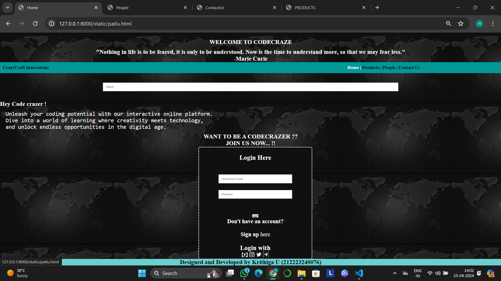
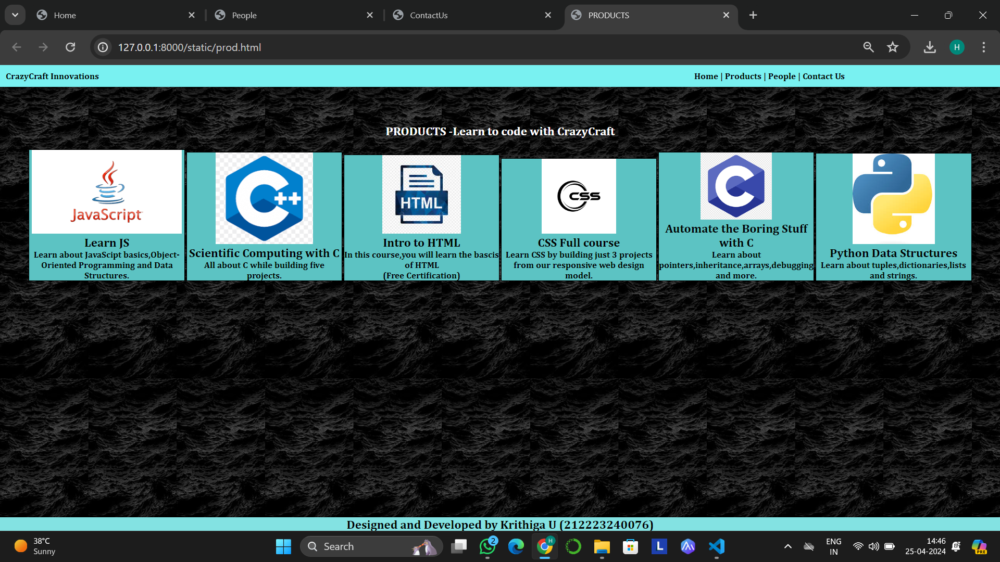
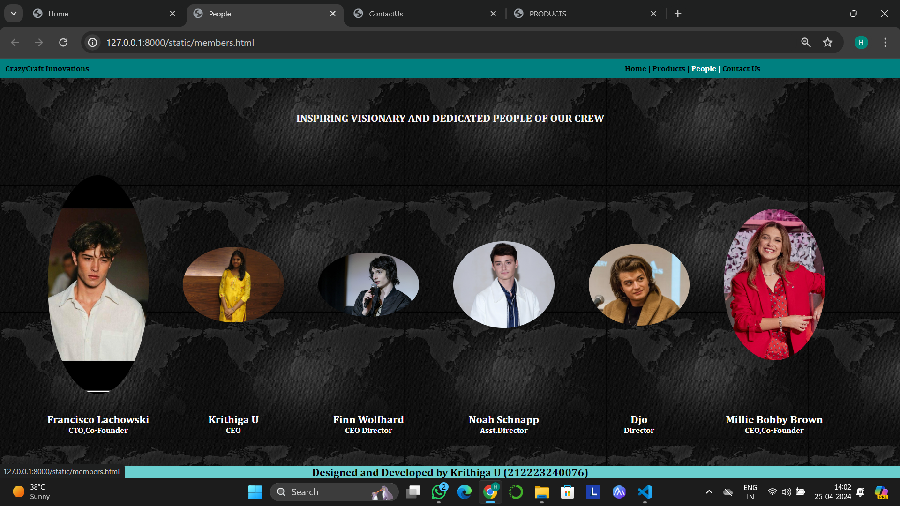
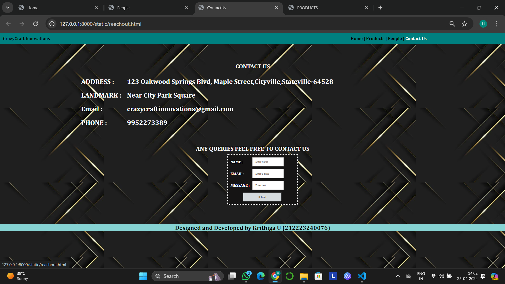

# Ex.07 Software Product Company Website
## Date:20.04.2024

## AIM:
To develop a static company website to display the softwares and services provided by the company.

## DESIGN STEPS:

### Step 1:
Requirement collection.

### Step 2:
Creating the layout using HTML and CSS.

### Step 3:
Updating the sample content.

### Step 4:
Choose the appropriate style and color scheme.

### Step 5:
Validate the layout in various browsers.

### Step 6:
Validate the HTML code.

### Step 7:
Publish the website in the given URL.

## PROGRAM:
```
patlu.html
<!DOCTYPE html>
<html lang="en">
<head>
    <meta charset="UTF-8">
    <meta name="viewport" content="width=device-width, initial-scale=1.0">
    <title>Home</title>
    <style>
        *{
            margin:0;
            padding:0
        }
        #nav{
            background-color:rgb(4, 151, 151);
            color:white;
            padding: 15px;
    
        }
        li,h1,ul{
            display:inline;
        }
        ul{
            margin-left:60%;
        }
        a{
            color:black;
            text-decoration: none;
        }
        a:hover{
            color:white;
            cursor:pointer;
        }
        input{
            width: 60%;
            padding: 15px;
        }
            .searchbar{
            padding:50px;
            text-align: center;
        }
        .center{
            text-align:center;
        }
        .box {
            display:inline-block;
            border-style:dotted ;
            border-radius: 10px;
            border-color: rgb(255, 255, 255);
            width: 600px;
            min-height: 50px;
            font-size: 30px;
            background-color:rgb(17, 16, 17);
        
        }
        .heading1{
            color:black;
            text-align: center;
            padding-top: 20px;
        }
        .heading2{
            color:rgb(247, 246, 250);
            text-align: justify;
            font-size: 30px;
            margin-left: 30px;
        }
        .edge{
            padding-left: 50px;
        }
        .box{
            text-align: center;
        }
        .bottomdiv{
            background-color:rgb(106, 207, 207);
            color:white;
            text-align: center;
            position:fixed;
            bottom:0;
            width:100%;

        }
        table{
            margin-left: 60px;
        }
    </style>
</head>
<body background="bg_2.jpg">
    <div class="center">
    <font color="white">
        <br><br>
        <h1><b>WELCOME TO CODECRAZE</b></h1><br><br>
        <h1><b>"Nothing in life is to be feared, it is only to be understood. Now is the time to understand more, so that we may fear less."<br>
            -Marie Curie</b></h1>
        </font>
</div>
</div>
    <div class="header">
        <nav id="nav">
            <h1>
                <font color="black">CrazyCraft Innovations</font>
                <ul>
                    <li class="li1"> 
                        <a href="patlu.html" target="_blank">Home  |</a>
                    </li>
                    <li class="li2"> 
                        <a href="prod.html" target="_blank">Products  |</a>
                    </li>
                    <li class="li4"> 
                        <a href="members.html" target="_blank">People  |</a>
                    </li>
                    <li class="li5"> 
                        <a href="reachout.html" target="_blank">Contact Us</a>
                    </li>
                </ul>
            </h1>    
        </nav>
    </div>
    <div class="searchbar">
    <input placeholder="Search">
    </div>
    <font color="white">
    <h1>Hey Code crazer !</h1>
    <br><br>
    </font>
        <div><pre class="heading2">Unleash your coding potential with our interactive online platform.
Dive into a world of learning where creativity meets technology,
and unlock endless opportunities in the digital age.</pre></div>
<br>
    <div class="center">
        <font color="white">
            <h1><b>WANT TO BE A CODECRAZER ??</b></h1><br>
            <h1><b>JOIN US NOW... !!</b></h1>
        </font>
        <br>
        <div class="edge">
            <div class="box">
                <div class="login">
                    <br>
                    <form>
                        <font color="white">
                        <h3>Login Here</h3>
                        <br>
                        <br>
                        <input type="text" placeholder="Username or Email"><br><br>
                        <input type="password" placeholder="Password"><br><br><br>
                        <button>Login</button>
                        <h4>Don't have an account?</h4><br>
                        <div class="Signup"><b>Sign up</b> here</div>
                        <br>
                        <h3>Login with</h3>
                        <div class="image">
                            
                            
                            
                            
                        </div>
                        </font>
                </div>
            </div>
        </div>
    <div class="bottomdiv">
        <font color="black">
        <h1>Designed and Developed by Krithiga U (212223240076)</h1>
    </font>
    </div>
</body>
<html>


prod.html

<!DOCTYPE html>
<html lang="en">
<head>
    <meta charset="UTF-8">
    <meta name="viewport" content="width=device-width, initial-scale=1.0">
    <title>PRODUCTS</title>
    <style>
        *{
            margin:0;
            padding:0;
            font-family:Cambria, Cochin, Georgia, Times, 'Times New Roman', serif;
        }
        #nav{
            background-color:rgb(121, 241, 241);
            color:white;
            padding: 15px;
    
        }
        li,.heading1,ul{
            display:inline;
        }
        ul{
            margin-left:60%
        }
        li{
            color:black;
        }
        li:hover{
            color:white;
            cursor:pointer;
        }
        input{
            width: 60%;
            padding: 15px;
        }
            .searchbar{
            padding:50px;
            text-align: center;
        }
        .box{
            border-color:black;
            border-width:2px;
            border-style:solid;
            display: inline-block;
            width: 414px;
        }
        .product{

            text-align: center;
        }
        .box{
            background-color:rgb(92, 195, 195);
            cursor:pointer;
        }
        a{
            color:black;
            text-decoration: none;
        }
        a:hover{
            color:white;
            cursor:pointer;
        }
        .heading2{
            padding-top: 100px;
            padding-bottom: 10px;
            text-align: center;
            color:white;
        }
        .bottomdiv{
            background-color:rgb(131, 226, 226);
            color:white;
            text-align: center;
            position:fixed;
            bottom:0;
            width:100%;
        }
    </style>
</head>
<body background="water.jpg">
    <div class="header">
        <nav id="nav">
            <h1>
                <font color="black">CrazyCraft Innovations</font>
                <ul>
                    <li class="li1"> 
                        <a href="patlu.html" target="_blank">Home  |</a>
                    </li>
                    <li class="li2"> 
                        <a href="prod.html" target="_blank">Products  |</a>
                    </li>
                    <li class="li4"> 
                        <a href="members.html" target="_blank">People  |</a>
                    </li>
                    <li class="li5"> 
                        <a href="reachout.html" target="_blank">Contact Us</a>
                    </li>
                </ul>
            </h1>    
        </nav>
    </div>
        <h1 class="heading2">PRODUCTS   -Learn to code with CrazyCraft</h1>
        <br>
        <div class="product">
            <div class="box">
                
                <h1>Learn JS</h1>
                <h2>Learn about JavaScipt basics,Object-Oriented Programming and Data Structures.</h2>
                </div>
            <div class="box">
                
                <h1>Scientific Computing with C</h1>
                <h2>All about C while building five projects.</h2>
                </div>
            <div class="box">
                
                <h1>Intro to HTML</h1>
                <h2>
                    In this course,you will learn the bascis of HTML<br>
                    (Free Certification)
                </h2>
            </div>
            <div class="box">
                
                <h1>CSS Full course</h1>
                <h2>Learn CSS by building just 3 projects from our responsive web design model.</h2>
                </div>
            <div class="box">
                
                <h1>Automate the Boring Stuff with C</h1>
                <h2>Learn about pointers,inheritance,arrays,debugging and more.</h2>
                </div>
            
            
            <div class="box">
                
                <h1>Python Data Structures</h1>
                <h2>Learn about tuples,dictionaries,lists and strings.</h2>
                </div>
        </div>
    </div>
    <div class="bottomdiv">
        <font color="black">
        <h1>Designed and Developed by Krithiga U (212223240076)</h1>
    </font>
    </div>
</body>
</html>

members.html

<!DOCTYPE html>
<html lang="en">
<head>
    <meta charset="UTF-8">
    <meta name="viewport" content="width=device-width, initial-scale=1.0">
    <title>People</title>
    <style>
        *{
            margin:0;
            padding:0;
            font-family:Cambria, Cochin, Georgia, Times, 'Times New Roman', serif;
        }
        #nav{
            background-color:teal;
            color:white;
            padding: 15px;
    
        }
        li,.heading1,ul{
            display:inline;
        }
        ul{
            margin-left:60%
        }
        li{
            color:black;
        }
        li:hover{
            color:white;
            cursor:pointer;
        }
        input{
            width: 60%;
            padding: 15px;
        }
        a{
            color:black;
            text-decoration: none;
        }
        a:hover{
            color:white;
            cursor:pointer;
        }
        .heading2{
            padding-top: 100px;
            padding-bottom: 10px;
            text-align: center;
            color:rgb(246, 244, 244);
        }
        .bottomdiv{
            background-color:rgb(106, 207, 207);
            color:white;
            text-align: center;
            position:fixed;
            bottom:0;
            width:100%;
        }
        img{
            border-radius: 100%;
            width: 300px;
            display: inline;
            padding:50px;
        }
        .person{
            margin:90px;
            text-align:center;
            
        }
        b,p{
            color:white;
            text-align: center;
        }
    </style>
</head>
<body background="bg_2.jpg">
    <div class="header">
        <nav id="nav">
            <h1>
                <font color="black">CrazyCraft Innovations</font>
                <ul>
                    <li class="li1"> 
                        <a href="patlu.html" target="_blank">Home  |</a>
                    </li>
                    <li class="li2"> 
                        <a href="prod.html" target="_blank">Products  |</a>
                    </li>
                    <li class="li4"> 
                        <a href="members.html" target="_blank">People  |</a>
                    </li>
                    <li class="li5"> 
                        <a href="reachout.html" target="_blank">Contact Us</a>
                    </li>
                </ul>
            </h1>    
        </nav>
    </div>
    <h1 class="heading2">INSPIRING VISIONARY AND DEDICATED PEOPLE OF OUR CREW</h1>
        <table class="person">
            <tr>
                <td>
                    
                </td>
                <td>
                    
                </td>
                <td>
                    
                </td>
                <td>
                    
                </td>
                <td>
                    
                </td>
                <td>
                    
                </td>
            </tr>
            <tr>
                <td>
                    <h1><b>Francisco Lachowski</b></h1>
                    <h2><p>CTO,Co-Founder</p></h2>
                </td>
                <td>
                    <h1><b>Krithiga U</b></h1>
                    <h2><p>CEO</p></h2>
                </td>
                <td>
                    <h1><b>Finn Wolfhard</b></h1>
                    <h2><p>CEO Director</p></h2>
                </td>
                <td>
                    <h1><b>Noah Schnapp</b></h1>
                    <h2><p>Asst.Director</p></h2>
                </td>
                <td>
                    <h1><b>Djo</b></h1>
                    <h2><p>Director</p></h2>
                </td>
                <td>
                    <h1><b>Millie Bobby Brown</b></h1>
                    <h2><p>CEO,Co-Founder</p></h2>
                </td>
            </tr>
        </table>
    </div>
    <div class="bottomdiv">
        <font color="black">
        <h1>Designed and Developed by Krithiga U (212223240076)</h1>
    </font>
    </div>
</body>
</html>

reachout.html

<!DOCTYPE html>
<html lang="en">
<head>
    <meta charset="UTF-8">
    <meta name="viewport" content="width=device-width, initial-scale=1.0">
    <title>ContactUs</title>
    <style>
        *{
            margin:0;
            padding:0;
            font-family:Cambria, Cochin, Georgia, Times, 'Times New Roman', serif;
        }
        #nav{
            background-color:teal;
            color:white;
            padding: 15px;
    
        }
        li,.heading1,ul{
            display:inline;
        }
        ul{
            margin-left:60%
        }
        li{
            color:black;
        }
        li:hover{
            color:white;
            cursor:pointer;
        }
        input{
            width: 60%;
            padding: 15px;
        }
            .searchbar{
            padding:50px;
            text-align: center;
        }
        .box{
            border-color:black;
            border-width:2px;
            border-style:solid;
            display: inline-block;
            width: 414px;
        }
        .product{

            text-align: center;
        }
        .box{
            background-color:teal;
            cursor:pointer;
        }
        a{
            color:black;
            text-decoration: none;
        }
        a:hover{
            color:white;
            cursor:pointer;
        }
        .heading2{
            padding-top: 100px;
            padding-bottom: 10px;
            text-align: center;
            color: rgb(249, 249, 242);
        }
        .table1{
            color:white;
            font-size: large;
        }
        .contactus{
            margin-left:400px;
        }
        .heading3{
            padding-top: 30px;
            padding-bottom: 10px;
            text-align: center;
            color:rgb(247, 243, 243);
        }
        .table2{
            color:white;
            font-size: large;
            background-color:rgb(21, 20, 20);
            border-radius: 5px;
            border-style:dotted;
            border-color: white;

        }
        .queries{
            margin-left:1200px;
        }
        .bottomdiv{
            background-color:rgb(134, 211, 211);
            color:white;
            text-align: center;
            position:relative;
            display:block;
            margin-top: 100px;

        }
    </style>
</head>
<body background="contact.png">
    <div class="header">
        <nav id="nav">
            <h1>
                <font color="black">CrazyCraft Innovations</font>
                <ul>
                    <li class="li1"> 
                        <a href="patlu.html" target="_blank">Home  |</a>
                    </li>
                    <li class="li2"> 
                        <a href="prod.html" target="_blank">Products  |</a>
                    </li>
                    <li class="li4"> 
                        <a href="members.html" target="_blank">People  |</a>
                    </li>
                    <li class="li5"> 
                        <a href="reachout.html" target="_blank">Contact Us</a>
                    </li>
                </ul>
            </h1>    
        </nav>
    </div>

        <h1 class="heading2"><b>CONTACT US</b></h1>
        <div class="contactus">
            <table cellpadding="30px" cellspacing="30px" class="table1">
                <tr>
                    <td>
                        <h1>ADDRESS :</h1>
                    </td>
                    <td>
                        <h1><b>123 Oakwood Springs Blvd, Maple Street,Cityville,Stateville-64528</b></h1>
                    </td>
                </tr>
                <tr>
                    <td>
                    <h1><b>LANDMARK :</b></h1>
                    </td>
                    <td>
                    <h1><b>Near City Park Square</b></h1>
                    </td>
                </tr>
                <tr>
                    <td>
                    <h1><b>Email :</b></h1>
                    </td>
                    <td>
                    <h1><b>crazycraftinnovations@gmail.com</b></h1>
                    </td>
                </tr>
                <tr>
                    <td>
                    <h1><b>PHONE :</b></h1>
                    </td>
                    <td>
                    <h1><b>9952273389</b></h1>
                    </td>
                </tr>
            </table>
        </div>
        <br>
        <br>
        <div>
            <h1 class="heading3"><b>ANY QUERIES FEEL FREE TO CONTACT US</b></h1>
            <div class="queries">
                <table cellpadding="15px" cellspacing="15px" class="table2">
                    <tr>
                        <td>
                            <h3><b>NAME :</b></h3>
                        </td>
                        <td>
                            <input type="name" placeholder="Enter Name"> 
                        </td>
                    </tr>
                    <tr>
                        <td>
                            <h3><b>EMAIL :</b></h3>
                        </td>
                        <td>
                            <input type="email" placeholder="Enter E-mail">
                        </td>
                    </tr>
                    <tr>
                        <td>
                            <h3><b>MESSAGE :</b></h3>
                        </td>
                        <td>
                            <input type="text" placeholder="Enter text">
                        </td>
                    </tr>
                    <tr>
                        <td colspan="2">
                            <div style="text-align:center;">
                            <input type="submit" style="background-color: rgb(213, 218, 221); color: black;" >
                            </div>
                        </td>
                    </tr>
            </table>
        </div>
        <div class="bottomdiv">
            <font color="black">
            <h1>Designed and Developed by Krithiga U (212223240076)</h1>
        </font>
        </div>
    </div>
</body>
</html>
```
## OUTPUT:









## RESULT:
The program for designing software company website using HTML and CSS is completed successfully.
